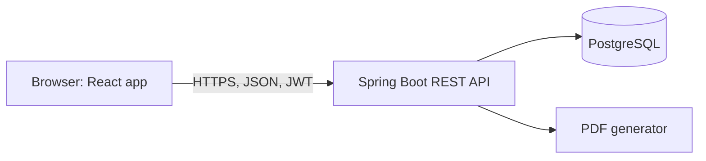
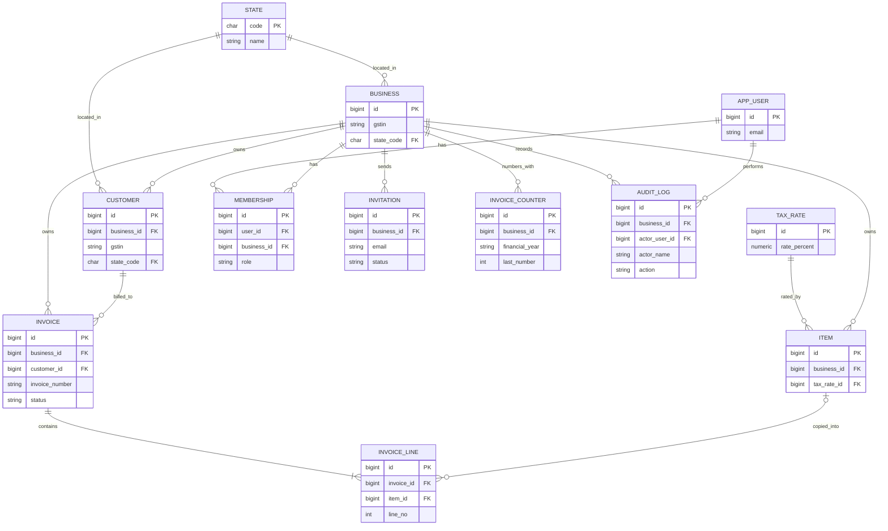
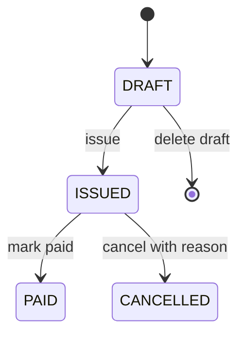
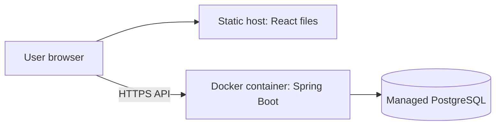

# GSTBridge: System Design Document

**Version:** 1.3 (fixes arising from the API design) | **Author:** Amandeep Kumar | **Date:** 4 Oct 2026 | **Stage:** 2 of 7 (System design)
**Based on:** GSTBridge PRD v1.2 and API Design Document v1.0

---

## 1. Purpose and scope

This document describes **how** GSTBridge will be built: the architecture, code structure, database, key flows, security, technology choices and deployment. The PRD defines **what** the product must do. Every design choice here traces back to a PRD requirement (see section 15).

Out of scope for this document: endpoint-by-endpoint API design (see the API Design Document, Stage 3), task breakdown (Stage 4), code and tests (Stage 5), and the hosting platform choice (Stage 6).

## 2. Decision log

| # | Decision | Choice | Main reason |
| --- | --- | --- | --- |
| 1 | Architecture style | Modular monolith (one Spring Boot app, one database), microservices considered for a later version | Issue-invoice must be one all-or-nothing transaction; solo builder; fast delivery |
| 2 | Frontend | React (separate app calling a REST API), built with AI assistance | API-first design, matches JWT and OpenAPI requirements |
| 3 | Backend structure | 7 feature modules, each layered (controller, dto, service, repository, entity, mapper) | Clear responsibilities; modules can be split into services later |
| 4 | Multi-tenancy | Shared tables with a `business_id` column on every tenant table, plus composite foreign keys | Simple, standard for small products; database backs up the application checks |
| 5 | Database | 12 tables, `NUMERIC` money, snapshots on issued invoices, counter table for numbering, CHECK constraints | Exactness, immutability, gap-free numbers |
| 6 | Issue flow | One transactional method; lock the invoice row, then the counter row; date order enforced inside the counter update; idempotent issue | No gaps, duplicates or backwards dates under concurrency |
| 7 | Security | BCrypt, JWT in the `Authorization` header, role read from the membership row plus tenant check on every request | PRD NFRs; HttpOnly cookie deferred |
| 8 | Validation, errors, files | Two-level validation, one JSON error format, PDF from HTML template on demand, streamed CSV | Consistency; PDF never stored |
| 9 | Stack and versions | Java 25, Spring Boot 4.1.x, Maven, PostgreSQL, Flyway, Testcontainers (full table in section 12) | Current LTS and supported generation |
| 10 | Deployment | Static frontend, Docker backend, managed PostgreSQL; platform chosen in Stage 6 | Portable, host-independent |
| 11 | Database logins | Separate migration login (owns tables) and runtime login (no ownership; no UPDATE, DELETE or TRUNCATE on `audit_log`) | Makes audit immutability real |
| 12 | Rounding and rates | Grand total to nearest rupee; line components 2 decimals HALF_UP; rates in a configurable `tax_rate` table | Decisions documented instead of left open |
| 13 | Status-change locking | Issue, pay, cancel and draft delete all take the invoice row lock first, then check status | Two simultaneous changes to one invoice cannot both succeed |

## 3. Architecture

### 3.1 Overview



- The React app is a pure client. It never touches the database and holds no business rules.
- The Spring Boot app owns all business rules. The server never trusts totals or tax amounts sent by the browser; it recomputes them.
- PostgreSQL is the single source of truth. Flyway migrations create and update the schema.

### 3.2 Why a monolith

A monolith keeps "issue invoice and assign its number" inside one database transaction, which is simple and reliable. Across services it would need distributed coordination. Internal module boundaries are kept clean (section 4.3) so that a module can later be extracted into its own service.

## 4. Backend structure

### 4.1 Modules

| Module | Responsibility |
| --- | --- |
| `auth` | Registration, login, JWT, memberships (list members, deactivate an Accountant), invitations (create, list, revoke, accept) |
| `business` | Business profile, GSTIN, state, invoice prefix |
| `customer` | Customers, B2B or B2C, deactivation |
| `catalog` | Items and services, HSN/SAC, tax rates |
| `invoice` | Drafts, tax calculation, numbering, lifecycle, PDF |
| `report` | Monthly summary, CSV export |
| `audit` | Append-only audit log |

### 4.2 Layers inside each module

| Layer | Role |
| --- | --- |
| Controller | Receives HTTP requests, validates input shape, returns responses. No business logic. |
| DTO (Java records) | Defines what goes in and out of the API; keeps password hashes and tenant ids out of responses. |
| Service | Business rules and transactions. The main target of unit tests. |
| Repository | Database access only. Every query includes `business_id`. |
| Entity | Java classes mapped to tables. |
| Mapper (MapStruct) | Converts between entities and DTOs. |

A request flows **Controller, Service, Repository, Database**, and the response returns as a DTO.

### 4.3 Rules

1. A layer only calls the layer directly below it.
2. A module calls another module **only through that module's service**, never its repository or tables.
3. Pure-logic classes have no database access, so they are easy to unit test: `TaxCalculator`, `GstinValidator`, `InvoiceNumberFormatter`, `AmountInWords`.

### 4.4 Package layout

```
com.gstbridge
  auth/  business/  customer/  catalog/  invoice/  report/  audit/
     controller/  dto/  service/  repository/  entity/  mapper/
  config/       (security, JWT filter, app settings)
  exception/    (global error handling)
  common/       (shared helpers)
```

## 5. Multi-tenancy

**Approach:** one database, shared tables, a `business_id` column on every tenant table (`customer`, `item`, `invoice`, `invoice_line`, `invoice_counter`, `membership`, `invitation`, `audit_log`). `state` and `tax_rate` are shared lookup tables.

**Safeguards:**

1. `business_id` is **never read from the request**. It comes from the JWT.
2. Every repository method includes `business_id`, for example `findByIdAndBusinessId(id, businessId)`. A record belonging to another business returns 404, so its existence is never revealed.
3. Tenant isolation tests: logged in as business A, every read and write against business B's data must fail.
4. The database enforces it too: composite foreign keys (section 6.4) stop an invoice, a line or an item reference from pointing at another business's record, even if application code has a bug.

## 6. Database design

### 6.1 Conventions

- `id` is a `BIGINT` generated primary key.
- Timestamps are `TIMESTAMPTZ` (`created_at`, `updated_at`).
- Money is `NUMERIC(14,2)`, never floating point. Java uses `BigDecimal`.
- Schema is managed by Flyway migrations (`V1__create_tables.sql`, `V2__seed_states_and_tax_rates.sql`, ...).
- `spring.jpa.hibernate.ddl-auto=validate`, so an entity change without a migration fails at startup.
- Absent values are `NULL`, never empty strings (draft invoice number, B2C customer GSTIN).

### 6.2 ER diagram (keys and key columns)



### 6.3 Tables and columns

**state** (about 37 rows, seeded)

| Column | Type | Notes |
| --- | --- | --- |
| code | CHAR(2) PK | "03" Punjab, "07" Delhi |
| name | VARCHAR(60) | |
| abbreviation | CHAR(2) | |

**tax_rate** (seeded from the current official rate schedule, verified before release)

| Column | Type | Notes |
| --- | --- | --- |
| id | PK | |
| rate_percent | NUMERIC(5,2) UQ | configurable, not hard-coded; lines may only use an active rate |
| active | BOOLEAN | |

**app_user**

| Column | Type | Notes |
| --- | --- | --- |
| email | VARCHAR(255) UQ | stored lowercase |
| password_hash | VARCHAR(100) | BCrypt |
| full_name | VARCHAR(120) | |
| active | BOOLEAN | |

**business** (the tenant)

| Column | Type | Notes |
| --- | --- | --- |
| legal_name | VARCHAR(150) | |
| gstin | CHAR(15) UQ | format and checksum validated; locked once any invoice is issued |
| state_code | CHAR(2) FK | must match first 2 digits of GSTIN |
| address_line, city, pincode | text | shown on PDF |
| invoice_prefix | VARCHAR(3) | 1 to 3 characters, A-Z and 0-9 only, stored uppercase (see 7.4); locked once any invoice is issued |

**membership**

| Column | Type | Notes |
| --- | --- | --- |
| user_id, business_id | FK | unique together |
| role | VARCHAR(20) | OWNER or ACCOUNTANT; this row, not the token, decides permissions |
| active | BOOLEAN | revoke access without deleting history |
| created_at | TIMESTAMPTZ | gives a deterministic order at login (section 9) |

**invitation**

| Column | Type | Notes |
| --- | --- | --- |
| business_id | FK | |
| email | VARCHAR(255) | invitee |
| role | VARCHAR(20) | ACCOUNTANT |
| token_hash | CHAR(64) UQ | SHA-256 (hex) of a 32-byte random token; the raw token appears only in the invite link and is never stored |
| status | VARCHAR(20) | PENDING, ACCEPTED, EXPIRED, REVOKED |
| invited_by | FK to app_user | |
| expires_at, accepted_at | TIMESTAMPTZ | |

**customer**

| Column | Type | Notes |
| --- | --- | --- |
| business_id | FK | |
| name | VARCHAR(150) | |
| gstin | CHAR(15) nullable | `NULL` means B2C; unique per business when present; first 2 digits must match `state_code` |
| state_code | CHAR(2) FK | required for all customers |
| address_line, city, pincode, email, phone | text | |
| active | BOOLEAN | deactivate, never hard-delete if used on an issued invoice |

**item**

| Column | Type | Notes |
| --- | --- | --- |
| business_id | FK | |
| name | VARCHAR(150) | |
| item_type | VARCHAR(10) | GOODS or SERVICE (HSN vs SAC) |
| hsn_sac_code | VARCHAR(8) | |
| unit | VARCHAR(20) | |
| default_price | NUMERIC(14,2) | CHECK >= 0 |
| tax_rate_id | FK | |
| active | BOOLEAN | |

**invoice**

| Column | Type | Notes |
| --- | --- | --- |
| business_id, customer_id | FK | composite FK to customer (section 6.4) |
| invoice_number | VARCHAR(16) nullable | `NULL` while DRAFT; unique per business |
| financial_year | VARCHAR(7) | e.g. "2026-27", set at issue |
| status | VARCHAR(10) | DRAFT, ISSUED, PAID, CANCELLED |
| invoice_date | DATE | |
| supply_type | VARCHAR(12) | INTRA_STATE or INTER_STATE |
| place_of_supply_state | CHAR(2) FK | |
| seller_name, seller_gstin, seller_state, seller_address | text | snapshot frozen at issue |
| buyer_name, buyer_gstin, buyer_state, buyer_address | text | snapshot; `NULL` GSTIN means B2C |
| total_taxable_value | NUMERIC(14,2) | |
| total_cgst, total_sgst, total_igst | NUMERIC(14,2) | sums of line amounts |
| total_before_round_off, round_off, grand_total | NUMERIC(14,2) | |
| issued_at, paid_at, cancelled_at | TIMESTAMPTZ | |
| cancel_reason | VARCHAR(255) | required when cancelled |
| created_by | FK to app_user | |
| version | INT | optimistic locking |

**invoice_line**

| Column | Type | Notes |
| --- | --- | --- |
| invoice_id, business_id | FK | composite FK to invoice |
| line_no | INT | unique with invoice_id |
| item_id | FK nullable | reference only; composite FK to item |
| description, hsn_sac_code, unit | text | snapshot of the item |
| quantity | NUMERIC(12,3) | CHECK > 0 |
| unit_price | NUMERIC(14,2) | CHECK >= 0 |
| discount_percent | NUMERIC(5,2) | percent entered; CHECK between 0 and 100 |
| discount_amount | NUMERIC(14,2) | computed and stored |
| taxable_value | NUMERIC(14,2) | quantity x price minus discount; CHECK >= 0 |
| tax_rate_percent | NUMERIC(5,2) | snapshot of an active `tax_rate`; validated in the service |
| cgst_amount, sgst_amount, igst_amount | NUMERIC(14,2) | each rounded per line |
| line_total | NUMERIC(14,2) | |

**invoice_counter**

| Column | Type | Notes |
| --- | --- | --- |
| business_id, financial_year | | unique together |
| last_number | INT | last number handed out |
| last_invoice_date | DATE | supports the date rule in 7.4 |

**audit_log** (insert only)

| Column | Type | Notes |
| --- | --- | --- |
| business_id | FK | |
| entity_type, entity_id | text, BIGINT | e.g. "INVOICE" and its id |
| action | VARCHAR(30) | CREATED, ISSUED, PAID, CANCELLED, DRAFT_DELETED |
| actor_user_id | FK | who |
| actor_name | VARCHAR(120) | the actor's full name at event time; a snapshot, never resolved from the current user, so a rename does not rewrite history |
| occurred_at | TIMESTAMPTZ | when |
| details | JSONB | `{}` for CREATED, PAID and DRAFT_DELETED; `{"invoiceNumber": "..."}` for ISSUED; `{"reason": "..."}` for CANCELLED |

**Immutability:** the migration login owns the tables. The runtime login that the app uses has `UPDATE`, `DELETE` and `TRUNCATE` revoked on `audit_log` in the migration that creates it, and the `AuditLog` entity is marked `@Immutable` so Hibernate never issues an UPDATE (which the database would reject and roll back the whole transaction). This stops the running app, including a coding mistake, from altering history. It does not protect against someone who holds the migration login.

### 6.4 Constraints and indexes

- Unique: `app_user.email`, `business.gstin`, `(business_id, invoice_number)`, `(business_id, gstin)` on customer when present, `(business_id, financial_year)` on counter, `(user_id, business_id)` on membership, `(invoice_id, line_no)`. Postgres allows many `NULL`s in a unique index, so many drafts and many B2C customers are fine.
- Tenant keys: `UNIQUE (id, business_id)` on `customer`, `item` and `invoice`. Composite foreign keys: `invoice (customer_id, business_id)` to `customer (id, business_id)`; `invoice_line (invoice_id, business_id)` to `invoice (id, business_id)`; `invoice_line (item_id, business_id)` to `item (id, business_id)`.
- Checks: item price >= 0; line quantity > 0; line unit price >= 0; discount percent between 0 and 100; line taxable value >= 0; `invoice_number` present whenever status is not DRAFT; business invoice prefix is 1 to 3 characters of A-Z and 0-9.
- Indexes (performance targets, 10,000 invoices): `(business_id, invoice_date)`, `(business_id, status)`, `(business_id, customer_id)`, `(business_id, invoice_number)`, `(business_id, name)` on customer.

## 7. Invoice design

### 7.1 Lifecycle



All other transitions are rejected. Drafts can be edited and deleted (deletion is audited). Issued invoices are immutable. Cancelled invoices keep their number and are excluded from tax totals. A PAID invoice cannot be cancelled in v1; credit notes arrive in release 2. Cancelling is an internal status, not a legal substitute for a credit note.

### 7.2 Tax and amount calculation

Implemented in `TaxCalculator`, a pure class with no database access.

1. Line gross = quantity x unit price. Discount amount = gross x discount percent / 100, rounded to 2 decimals. Taxable value = gross minus discount.
2. Tax type: seller state equals buyer state means CGST + SGST, otherwise IGST.
3. Intra-state: CGST and SGST are each (taxable value x rate / 2 / 100), rounded to 2 decimals per line. Inter-state: IGST = taxable value x rate / 100, rounded to 2 decimals per line.
4. Invoice totals are the sums of the stored line amounts, so reports match the invoices exactly.
5. Grand total = total taxable value + total tax, rounded to the nearest rupee. Round-off = rounded total minus exact total, stored separately.
6. All arithmetic uses `BigDecimal` with `RoundingMode.HALF_UP`. Two documented decisions: (a) the grand total is rounded to the nearest rupee, with 50 paise and above rounding up, following the GST Act rounding provision (s.170; verify before release); (b) rounding each line component to 2 decimals is a software convention, not statute.
7. Each line's rate must match an active `tax_rate` row.
8. Drafts: totals, tax type and line amounts are computed by `TaxCalculator` and stored on every draft save, using the current customer and business state, so lists show real numbers. The draft detail and the draft PDF recompute from the current business and customer state on read (read-only, nothing is stored), so they never show a live party next to a stale tax split. Lists show last-saved totals, which differ only after a customer or business state change. Everything is recomputed again at issue (7.3, step 5), so a draft's stored numbers are never trusted.

### 7.3 Issue flow (one `@Transactional` method)

Principle: take the locks first, then check, so every check sees the final state.

1. Check the caller is an Owner (role from the membership row) and the invoice belongs to the caller's business.
2. Lock the invoice row (`SELECT ... FOR UPDATE`). If its status is ISSUED, return it unchanged (idempotent issue; no number used). If it is anything other than DRAFT, return 422. A second simultaneous request waits for the first and then takes the idempotent path. The `version` column stays as a backstop.
3. Validate: at least one line (`INVOICE_HAS_NO_LINES`); every line valid (quantity > 0, price >= 0, discount 0 to 100, active rate); customer active; customer GSTIN (when present) matches the customer's state and the business GSTIN matches the business's state (`GSTIN_STATE_MISMATCH`; a safety net, since registration and edits already enforce both); invoice date not in the future, using the Asia/Kolkata date.
4. Derive the financial year from the invoice date (1 April to 31 March).
5. Recompute all amounts on the server with `TaxCalculator`.
6. Decide the tax type from seller and buyer state.
7. Take the next number and enforce date order in one statement (7.4).
8. Freeze the invoice: seller and buyer snapshot, number, financial year, tax type, totals, `issued_at`, status ISSUED.
9. Write the audit record.
10. Commit. Any failure rolls back everything, including the counter.

### 7.4 Gap-free invoice numbers and date order

1. Make sure the counter row exists, with a statement that does not fail if another request created it first (a plain insert would raise a unique violation, which aborts the whole transaction in PostgreSQL; this happens on the first issue of every financial year):

   ```sql
   INSERT INTO invoice_counter (business_id, financial_year, last_number)
   VALUES (:b, :fy, 0)
   ON CONFLICT (business_id, financial_year) DO NOTHING;
   ```

2. Take the next number and enforce date order in one conditional update. The update locks the counter row, so concurrent requests queue, and the date check happens against the locked row, so the stored date can never move backwards:

   ```sql
   UPDATE invoice_counter
      SET last_number = last_number + 1, last_invoice_date = :date
    WHERE business_id = :b
      AND financial_year = :fy
      AND (last_invoice_date IS NULL OR last_invoice_date <= :date)
   RETURNING last_number;
   ```

   Zero rows updated: reject with 422 `INVOICE_DATE_OUT_OF_ORDER`. If the returned number is above 9999: reject with 422 `SEQUENCE_EXHAUSTED`; the transaction rolls back.
3. Format the number as `PREFIX/2026-27/0001`.

No gaps: the counter update shares the invoice's transaction, so a failure rolls the number back. No duplicates: the row lock serialises requests, and the unique constraint on `(business_id, invoice_number)` is the backstop.

Limits: invoice numbers are at most 16 characters (BR-3). `INV/2026-27/0001` is exactly 16, so the prefix is limited to **3 characters** and the sequence runs 0001 to 9999 per financial year. The 10,000th issue is rejected with a clear error.

### 7.5 Mark paid and cancel

Principle (same as issue, 7.3): take the invoice row lock first (`SELECT ... FOR UPDATE`), then check the status. Without the lock, a simultaneous pay and cancel could both pass the status check and the final state would depend on who wrote last. With it, one wins and the other gets 422.

- **Mark paid:** lock; status must be ISSUED; set PAID and `paid_at`; audit.
- **Cancel:** lock; status must be ISSUED (a PAID invoice cannot be cancelled in v1, and a DRAFT is deleted, not cancelled); reason required, trimmed, 1 to 255 characters; set CANCELLED, `cancelled_at`, `cancel_reason`; audit. The number stays used.
- **Delete draft:** takes the same lock, so a delete and an issue racing each other cannot both succeed; status must be DRAFT; audit.

## 8. Reports

Monthly summary is computed in SQL from the invoice header columns, scoped to the caller's business, for the chosen month on `invoice_date`, ISSUED and PAID only:

```sql
SELECT COUNT(*)                         AS invoice_count,
       COALESCE(SUM(total_taxable_value), 0) AS taxable_value,
       COALESCE(SUM(total_cgst), 0)     AS cgst,
       COALESCE(SUM(total_sgst), 0)     AS sgst,
       COALESCE(SUM(total_igst), 0)     AS igst,
       COALESCE(SUM(round_off), 0)      AS round_off,
       COALESCE(SUM(grand_total), 0)    AS grand_total
  FROM invoice
 WHERE business_id = :businessId
   AND status IN ('ISSUED', 'PAID')
   AND invoice_date >= :monthStart
   AND invoice_date <  :nextMonthStart;
```

Footing rule: taxable value, CGST, SGST and IGST equal the sums over the invoices exactly, and grand total = taxable value + CGST + SGST + IGST + round-off. Drafts and cancelled invoices are excluded.

CSV export streams rows from the database to the response without loading everything into memory. Columns: number, date, customer, customer GSTIN, status, taxable value, CGST, SGST, IGST, round-off, grand total. Only ISSUED and PAID invoices are included. Rows are sorted by invoice date, then id, ascending (also invoice-number order). Money is written as plain decimals with 2 places. Format: UTF-8 with a byte-order mark (so Excel shows non-English names correctly), CRLF line endings, RFC 4180 quoting, a header row, dates as `yyyy-MM-dd`. Formula-injection protection applies to **text cells only**: a text cell that starts with `=`, `+`, `-` or `@` gets a leading `'`. Numeric columns are never altered, because round-off can be negative (for example `-0.40`).

The summary CSV is one row for the chosen month, produced from the same query as the on-screen summary. Columns: month (YYYY-MM), invoice count, taxable value, CGST, SGST, IGST, round-off, grand total. Both exports and the on-screen summary take a required `month` (`YYYY-MM`) and nothing else in v1, so the invoice CSV for a month always foots to that month's summary. A valid month with no invoices returns a zeroed summary and a header-only invoice CSV.

## 9. Security design

**Authentication**

1. `POST /api/auth/login` with email and password. The password is checked against the BCrypt hash.
2. On success the server issues a JWT (expiry 8 hours) containing user id, business id and role, signed with a secret key. If the user has several memberships, v1 uses the first active one ordered by `created_at, id` (a business switcher is deferred). The role in the token is informational only.
3. The React app sends `Authorization: Bearer <token>` on every request. A Spring Security filter validates it. Missing or invalid token returns 401; wrong role returns 403.
4. On every request the filter loads the membership by the token's user id **and** business id, rejects the request if it is missing or inactive, and takes the role from the **row**, not the token. So revoking an Accountant, or changing a role, takes effect immediately.

**Authorization:** a role check per endpoint (for example `@PreAuthorize("hasRole('OWNER')")`) plus the tenant check from section 5. Accountants have read and export access only. The Owner can list members and deactivate an Accountant; revocation takes effect on the very next request.

**Other measures:** password length 8 to 72 UTF-8 bytes (BCrypt ignores anything beyond 72 bytes); login errors are vague ("Invalid email or password"); CORS allows only the frontend origin; secrets come from environment variables, never from code.

**Invitations (Should):** the token is 32 bytes from `SecureRandom`, stored only as a SHA-256 hash (BCrypt is salted and cannot be looked up by value, so it is used for passwords only). Invitations expire after 7 days, the invite link is built from a configured frontend origin, and the token is consumed atomically and only once. The accepting account's email must match the invitation email. One pending invitation per email per business. Accepting an invitation reactivates a previously deactivated membership. If time is short, the demo uses a seeded Accountant instead.

**Token storage:** v1 keeps the token in browser memory or local storage. Moving to an HttpOnly cookie (with CSRF protection) is a documented future hardening step.

## 10. Validation and errors

**Validation levels**

- Shape validation (controller, annotations on request DTOs): `@NotBlank`, `@Email`, `@Size`, `@Positive` and similar.
- Business validation (service): GSTIN checksum (`GstinValidator`), GSTIN state matching for business and customers, active tax rate, customer active, status rules, date rule.
- Strict parsing: unknown fields and read-only fields in a request body return 400 on every endpoint (`FAIL_ON_UNKNOWN_PROPERTIES` on), so the server never silently ignores or trusts client-sent amounts.

**One error format for every endpoint** (global `@RestControllerAdvice`):

```json
{
  "timestamp": "2026-10-04T10:15:30Z",
  "status": 422,
  "code": "INVALID_STATUS_TRANSITION",
  "message": "Only draft invoices can be issued",
  "fieldErrors": [],
  "path": "/api/invoices/42/issue"
}
```

| Status | Use |
| --- | --- |
| 400 | Malformed or invalid input |
| 401 | Not authenticated |
| 403 | Wrong role |
| 404 | Not found, including records of another business |
| 409 | Conflict: duplicate email or GSTIN, version clash |
| 422 | Valid request that breaks a business rule |
| 500 | Unexpected error, generic message, no stack trace |

**Pagination:** default page 0, default page size 20, maximum 100, default order `invoice_date DESC, id DESC`. A non-numeric or negative `page`, or a `size` outside 1 to 100, returns 400 instead of being clamped. `fieldErrors` entries have the shape `{ "field", "message" }`.

**Paths:** every endpoint lives under `/api` (for example `/api/auth/login` and `/api/invoices/42/issue`). The full list is in the API Design Document, including the public operational endpoints `/api/actuator/health`, `/api/docs` and `/api/swagger-ui.html`.

## 11. PDF generation

The PDF is generated on demand and is never stored. For ISSUED, PAID and CANCELLED invoices it uses the frozen invoice snapshot. A DRAFT has no snapshot yet, so its PDF uses the current business, customer and line data and recomputes the amounts from that current state (read-only, nothing is stored).

1. Load the invoice from the database (the snapshot columns for an issued invoice; for a draft, also the current business and customer).
2. Fill an HTML template (`invoice.html`, Thymeleaf) with the data.
3. Convert the filled HTML to PDF with an HTML-to-PDF library.
4. Return the bytes with a PDF content type.

Required content (FR-4.7): seller and buyer details and GSTINs, invoice number and date, place of supply, per-line description, quantity, unit, rate and HSN/SAC, taxable value, tax breakup, reverse-charge indicator, totals, amount in words (Indian system, handled by `AmountInWords`), and a signature block. Drafts are rendered with a DRAFT watermark; cancelled invoices show their status and reason. The template is not versioned, so a later template change alters the look, not the data, of old PDFs; this is accepted. Target: under 3 seconds.

The library is **to be decided by the walking-skeleton test** (section 12.3): openhtmltopdf is the first candidate (use the maintained `io.github.openhtmltopdf` coordinates; the old `com.openhtmltopdf` group is unmaintained), with OpenPDF (layout drawn in code) as the fallback.

## 12. Technology stack and version policy

### 12.1 Stack

| Area | Choice |
| --- | --- |
| Language | Java 25 (LTS) |
| Framework | Spring Boot 4.1.x |
| Build tool | Maven |
| Database | PostgreSQL (current stable) |
| Data access | Spring Data JPA (Hibernate) |
| Migrations | Flyway |
| Security | Spring Security + JWT |
| Mapping | MapStruct; DTOs as Java records |
| API docs | springdoc-openapi (Swagger UI), 3.1.x line |
| PDF | Thymeleaf + HTML-to-PDF library (to be decided) |
| Testing | JUnit, Mockito, Testcontainers (real PostgreSQL), JaCoCo (reported for information) |
| Frontend | React + Vite |
| Local environment | Docker Compose (PostgreSQL) |
| Source control and CI | Git, GitHub, GitHub Actions |

### 12.2 Version policy

1. Versions of libraries managed by Spring Boot (Hibernate, Flyway, Thymeleaf, Spring Security, Testcontainers, testing tools, database driver) are **not pinned by hand**.
2. Every other library is checked individually for compatibility and pinned to an exact version (never "latest") in the table below.
3. Any version suggested by an AI tool that is not in the table is rejected until verified.
4. Verify coordinates and import packages, not only version numbers. AI tools more often suggest the wrong library generation (for example Jackson 3 coordinates under Boot 4, the Testcontainers 2.x package layout, or the unmaintained openhtmltopdf group) than a wrong number.

### 12.3 Version table (to be completed during the walking skeleton)

Values marked "suggested" came from an AI review and must be verified before pinning.

| Item | Version | Status |
| --- | --- | --- |
| Java | 25 | Spring Boot 4.1.1 documents support from Java 17 up to Java 26 |
| Spring Boot | 4.1.x (4.1.1 was current when checked) | Verified in docs |
| springdoc-openapi | 3.1.x | Reported working with Boot 4.1.1 and JDK 25 in one third-party test; confirm in skeleton |
| MapStruct | 1.6.3 (suggested) | On JDK 23+ set `<maven.compiler.proc>full</maven.compiler.proc>`, or no mappers are generated |
| JWT library | Spring Security's Boot-managed JWT support (preferred) or jjwt 0.13.0 (suggested) | Verify in skeleton |
| PDF library | to decide | `io.github.openhtmltopdf` (about 1.1.87, suggested) first candidate; Java 25 support unconfirmed; fallback OpenPDF |
| Node.js, React, Vite | Node 24 LTS (suggested); React and Vite to verify | Not yet checked |

**Walking skeleton (first build task):** a tiny app containing every library that starts on Java 25, runs one Flyway migration, passes one Testcontainers PostgreSQL test, shows the Swagger page and produces one sample PDF, with `ddl-auto=validate` on. GitHub Actions runs the same build with the same Java version on every push.

## 13. Repository, testing and quality

**Repository layout**

```
gstbridge/
  backend/    (Spring Boot app)
  frontend/   (React app)
  docs/       (PRD, this design doc, API docs, test report)
  docker-compose.yml
  README.md
```

**Test plan** (this enumerated list is the acceptance measure; JaCoCo is reported for information only)

| Area | Tests |
| --- | --- |
| Tax logic | Every seeded rate x intra-state and inter-state; round-off at exactly 0.50; discount at 0% and 100%; per-line CGST/SGST halves |
| GSTIN | Valid and invalid format, state code and checksum; customer GSTIN versus state mismatch |
| Lifecycle | Every allowed transition and every rejected transition, including cancelling a PAID invoice |
| Numbering | Concurrency test on real PostgreSQL: about 50 simultaneous issues for one business, unique numbers 1 to 50 with no gaps. Same draft issued twice concurrently gives exactly one number. A failure injected after the counter update consumes no number. Two issues with out-of-order dates never move the counter backwards. Invoice number at exactly 16 characters; sequence at 9999 and 10,000. Write these tests first and confirm they fail against a naive implementation. |
| Tenant isolation | Business A cannot read or change business B's data on any endpoint. Writes too: linking another business's customer or item is rejected by the database. |
| Authorization matrix | `{anonymous, owner, accountant} x {list, detail, create, edit, delete, CSV, PDF, audit, calculate, members}` asserting 401, 403 or 200 |
| End to end | One HTTP-level test through filter, controller, advice and service: register, create draft, issue, assert number format, status, one audit row and totals equal to the sum of lines; then issue a non-draft and expect 422 |
| Reports | Taxable and tax totals equal the sum of invoices; taxable + tax + round-off = grand total; drafts and cancelled excluded; one business's summary never includes another's |
| PDF | An issued invoice's PDF keeps the original seller, buyer and amounts after the business, customer or item is edited; a draft PDF carries the DRAFT watermark and uses current data; a cancelled PDF shows status and reason |
| Status-change races | Simultaneous pay and cancel on one invoice leave one winner and one 422; a delete racing an issue cannot both succeed |
| Idempotent issue | A repeat issue returns an identical body, consumes no number and writes one audit row only |
| Calculate parity | For random invoices, the calculate endpoints equal what a draft save stores and what issue freezes |
| Draft recompute | Changing a customer's state changes a draft's detail and PDF, never an issued invoice |
| CSV | The invoice CSV for a month sums to the monthly summary; a negative round-off is not escaped; a customer name starting with `=` is escaped; an empty month gives the documented outputs |
| Audit | Exact action values and `details` shapes; the actor name is unchanged after the user is renamed |
| Strict parsing and limits | Unknown and read-only fields return 400 on every write endpoint; 101 lines, an out-of-range amount, excess precision and a password over 72 bytes are rejected |
| Invitations | Token usable once and stored hashed; wrong-email and expired tokens give the same generic error; a deactivated Accountant is refused on the very next request |
| Business lock | Changing the GSTIN or prefix after the first issue returns 422, including when racing the first issue |
| Property test | For random invoices, the sum of line taxes equals the invoice tax |
| Performance | Seed 10,000 invoices; check list, summary and PDF speed targets |
| Coverage | JaCoCo reported for information; not a pass/fail target |

## 14. Deployment



- Frontend builds to static files served by static hosting.
- Backend runs as a Docker container; configuration and secrets come from environment variables.
- Flyway applies migrations when the backend starts, using the migration login (table owner). The app itself connects with a separate runtime login that has only the privileges it needs, with no ownership and no UPDATE, DELETE or TRUNCATE on `audit_log`.
- A seed script creates synthetic demo data, including an Accountant user and the 10,000-invoice load, so the demo can be rebuilt quickly. Seed invoices by calling the issue service, or set each `invoice_counter` to the highest issued number after a bulk load or backup restore, so numbering stays consistent. Keep database dumps as backups.
- The host health check calls `GET /api/actuator/health` (public, the only Actuator endpoint exposed). The OpenAPI spec and Swagger UI are public under `/api/docs` and `/api/swagger-ui.html`; in the deployed demo the try-it-out console is disabled by configuration.
- Hosting platform is chosen in Stage 6. Free tiers are limited (cold starts, small memory, expiring or capped databases), so a low-cost paid plan is a real option. Prices are re-checked at that time.

## 15. Requirements traceability

| PRD requirement | Design element |
| --- | --- |
| FR-1.1 Register and create business | `auth` + `business` modules, `app_user`, `business`, `membership`, BCrypt |
| FR-1.2 Business profile, GSTIN, state, locked after first issue | `business` table, `GstinValidator`, `state` table |
| FR-1.3 Login with token, 401 and 403, immediate revocation | JWT filter, membership lookup per request (section 9); member deactivation endpoint (API design 5.5) |
| FR-2.1 Customers, B2B or B2C, GSTIN-state match, no hard delete | `customer` table, `active` flag, composite foreign key from invoice |
| FR-3.1 Items, configurable rates, price rule, issued invoices unchanged | `item`, `tax_rate`, snapshot columns on `invoice_line` |
| FR-4.1 Draft invoice and line rules | `invoice` DRAFT status, `invoice_line` CHECK constraints |
| FR-4.2 Automatic tax split | `TaxCalculator`, `supply_type` (7.2) |
| FR-4.3 Exact arithmetic, round-off | `NUMERIC`, `BigDecimal`, `round_off` (7.2) |
| FR-4.4 Gap-free numbers, date rule, idempotent issue | `invoice_counter`, invoice row lock, conditional update (7.3, 7.4) |
| FR-4.5 Issued invoices immutable | Status check, snapshot, version column |
| FR-4.6 Paid and cancel transitions | Lifecycle (7.1, 7.5) |
| FR-4.7 PDF | On-demand PDF: snapshot for issued invoices, current data for drafts (section 11) |
| FR-4.8 List, search, filter, paginate | Indexes (6.4), paginated queries (section 10) |
| FR-5.1 Monthly summary | SQL aggregation on invoice header (section 8) |
| FR-5.2 CSV export (Should) | Streamed, escaped invoice CSV and a one-row summary CSV, columns defined (section 8) |
| FR-6.1 Audit trail | `audit_log`, insert-only, actor name snapshot, runtime login revoked UPDATE/DELETE/TRUNCATE, `@Immutable` |
| Should: invite Accountant | `invitation` table, hashed token, copyable invite link |
| NFR Security and tenant isolation | Sections 5 and 9, composite foreign keys |
| NFR Speed | Indexes, pagination, SQL aggregation, on-demand PDF |
| NFR Correctness | Pure `TaxCalculator`, enumerated tests (section 13) |
| NFR Maintainability | Layered modules, OpenAPI, README |

## 16. Assumptions and defaults chosen where the PRD was silent

| # | Gap in the PRD | Default used |
| --- | --- | --- |
| A | Invoice number limit of 16 characters | Prefix max 3 characters; sequence 0001 to 9999 per year |
| B | Discount type | Entered as a percentage per line; amount computed and stored |
| C | Draft handling | Drafts editable and deletable, deletion audited, drafts cannot be cancelled |
| D | Invoice date versus number order | At issue, date cannot be in the future or earlier than the last issued date in that financial year; checked inside the counter update |
| E | Token lifetime | Single JWT, 8 hours, no refresh tokens in v1 |
| F | Accountant invite delivery | Owner copies an invite link; no email sending in v1 |
| G | Reports and Paid invoices | Both ISSUED and PAID count; DRAFT and CANCELLED never count |
| H | Users and businesses | One user can belong to many businesses via `membership`; v1 uses the first active one by `created_at, id` |
| I | Rounding | Grand total to nearest rupee; line components 2 decimals HALF_UP |
| J | Corrections | Cancel and re-issue dated today; PAID cannot be cancelled; credit notes in release 2 |
| K | Time zone | Asia/Kolkata for invoice-date validation |
| L | Pagination | Default 20, max 100, newest invoice date first |
| M | Draft totals and draft PDF | Totals are computed and stored on every draft save and recomputed at issue; draft detail and draft PDF recompute from current state on read; lists show last-saved totals |
| N | Place of supply | The customer's state (a v1 simplification, flagged for CA review) |
| O | Reverse charge | Always "No" in v1: a server-owned constant with no column (flagged for CA review) |
| P | Concurrent edits | Customers, items and the business profile are last-write-wins; only invoices carry a version |

## 17. Open items

1. PDF library: decide in the walking-skeleton test.
2. Hosting platform: decide in Stage 6.
3. Credit notes: release 2; the design allows adding a linked invoice-like record later.
4. Before release, verify against official GST sources or a Chartered Accountant: the seeded tax rates, the s.170 rounding behaviour, the e-invoicing threshold, the place-of-supply simplification, the reverse-charge assumption and the HSN/SAC length rule (4 to 8 digits is provisional). The PRD itself states these rules are a simplified model, not tax advice.
5. Unverified library versions in section 12.3.

## 18. Deferred to later versions

- HttpOnly cookie token storage and CSRF protection
- Refresh tokens
- Business switcher screen for users with several businesses
- Brute-force login protection and password reset (demo accounts only until then)
- Real email sending for invitations; emailing invoices to customers
- Credit notes
- GSTR-1-style export, recurring invoices, dashboard charts
- Splitting modules into microservices

## 19. Changes

### From 1.2 to 1.3

- Pay, cancel and draft delete take the invoice row lock first, like issue (7.5, decision 13).
- Issue also checks the business GSTIN against the business state, and rejects a draft with no lines (7.3).
- CSV: escaping applies to text cells only; format details and month-only exports specified (section 8).
- `audit_log`: `actor_name` snapshot column and exact `details` shapes (6.3).
- Draft detail and draft PDF recompute from current state on read; lists show last-saved totals (7.2, section 11).
- Invoice prefix limited to A-Z and 0-9 (with a CHECK); password 8 to 72 UTF-8 bytes; invitations expire after 7 days with a configured link origin and a single-use token (sections 6, 9).
- Strict request parsing, 400 on bad paging, `fieldErrors` shape, operational endpoints under `/api` (sections 10, 14).
- `auth` module now includes member management and invitation list and revoke (4.1).
- Test plan extended with races, idempotent issue, calculate parity, draft recompute, CSV, audit, strict parsing, invitations and the business lock (section 13); traceability and assumptions N to P added; open item 4 extended.

### From 1.1 to 1.2

- Paths: `/auth/login` corrected to `/api/auth/login`; rule added that every endpoint lives under `/api`.
- PDF: drafts use current data (they have no snapshot); issued, paid and cancelled invoices use the frozen snapshot. Draft totals are stored on each save and recomputed at issue (7.2, point 8).
- Summary CSV columns defined, matching PRD v1.2 FR-5.2.
- Test plan: PDF added to the authorization matrix, plus a PDF test row.
- Traceability and assumptions updated (FR-4.7, FR-5.2, new assumption M).

### From 1.0 to 1.1

- Issue flow reordered: lock the invoice row first, then take the number and enforce date order in one conditional counter update; `INSERT ... ON CONFLICT DO NOTHING` specified for the counter row.
- Monthly summary SQL written out with `business_id` scoping; round-off added; footing rule restated.
- Audit immutability made real with separate migration and runtime database logins, a REVOKE and `@Immutable`.
- Composite tenant foreign keys and line-level CHECK constraints added; `NULL` semantics defined for draft numbers and B2C GSTIN.
- Role read from the membership row on every request; deterministic membership ordering; invite token stored as SHA-256.
- Rates configurable; rounding decisions documented; version table filled with suggested values to verify; `ddl-auto=validate`.
- PDF content extended; draft and cancelled handling defined; pagination, CSV columns, time zone and seed consistency specified.
- Test plan replaced with an enumerated list including concurrency edge cases, an authorization matrix and an end-to-end test.
