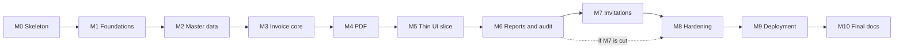

# GSTBridge: Implementation Plan

**Version:** 1.0 | **Author:** Amandeep Kumar | **Date:** 5 Oct 2026 | **Stage:** 4 of 7 (Implementation plan)
**Based on:** GSTBridge PRD v1.2, System Design Document v1.3 and API Design Document v1.0

---

## 1. Purpose and scope

This document says **in what order** GSTBridge will be built: milestones, half-day tasks, dependencies, risks, a cut list and a timeline. The PRD defines what the product does, the design document defines how it is built, the API document defines the contract, and this plan turns them into work.

Stage mapping: milestones M0 to M8 are Stage 5 (build and test), M9 is Stage 6 (deployment and demo data), M10 is Stage 7 (final documentation).

The plan applies to all three build versions (v1 no AI, v2 moderate AI, v3 high AI); scope is identical. The **Mode** column and section 4.4 describe the primary build, v2.

## 2. Planning principles

1. **Walking skeleton first.** Prove that Java 25, Spring Boot 4.1, Testcontainers, Flyway, MapStruct, JWT and the PDF library work together before any feature is built.
2. **Riskiest first inside the feature work.** Numbering, row locking and tax calculation (M3) come right after the foundations and master data, and the issue flow is built early inside M3.
3. **Backend first through the PDF, then a thin UI slice (M5).** The slice proves the contract end to end, including token-fetched downloads, before reports and the remaining screens.
4. **Tests live inside the feature tasks.** The numbering concurrency tests are written first and shown failing against a naive implementation. Hardening (M8) holds only the cross-cutting sweeps that make sense once everything exists.
5. **Database ownership is set up in M1**, not M8: the migration login, the runtime login and the `audit_log` REVOKE. Retrofitting privileges onto a finished schema is painful. M8 and M9 verify it.
6. **Half-day tasks.** Each task is about half a day, has a testable deliverable, and names the PRD, API and design sections it implements.

## 3. Milestone map

| # | Milestone | Tasks | Est. days | Exit criteria |
| --- | --- | --- | --- | --- |
| M0 | Walking skeleton | 4 | 2 | Every library starts on Java 25; one Flyway migration, one Testcontainers test, the Swagger page and one sample PDF work; CI is green; the version table in design 12.3 is fully pinned |
| M1 | Foundations: schema, security, tenancy, business | 8 | 4 | Full schema migrated; `GstinValidator` tested; register, login and `/me` work; every query is tenant-scoped (ArchUnit rule passes); error format and strict parsing are global; migration and runtime database logins are in place |
| M2 | Master data | 4 | 2 | Customers, items, states and tax rates match API sections 4, 7 and 8; tenant isolation proven on customers and items |
| M3 | Invoice core | 12 | 6 | Tax calculator, drafts, calculate, issue, pay, cancel, delete and list work; 50 concurrent issues give numbers 1 to 50 with no gaps |
| M4 | PDF | 3 | 1.5 | PDF meets FR-4.7, with DRAFT watermark and cancelled marking, in under 3 seconds |
| M5 | Thin UI slice | 8 | 4 | In the browser: register, business, customer, item, draft with live tax split, issue, download PDF |
| M6 | Reports, CSV, audit view | 6 | 3 | Summary foots exactly; both CSVs match the documented format; audit history works; UI pages exist |
| M7 | Invitations and members (Should; cuttable) | 4 | 2 | Invite, accept, list, revoke and deactivate work end to end |
| M8 | Hardening | 6 | 3 | Every test in design section 13 passes; speed targets met with 10,000 invoices |
| M9 | Deployment and demo data | 5 | 2.5 | Public demo link, health check green, synthetic data seeded |
| M10 | Final documentation | 4 | 2 | README, test report, build log, final document versions |
| | **Total** | **64** | **32** | |

## 4. Working agreements

### 4.1 Definition of done

A task is done when its code and tests pass, CI is green, the endpoint shows in Swagger, and any change to the contract is reflected in the API document.

### 4.2 Git and CI

- Short feature branches merged into `main` through your own pull requests; small commits.
- GitHub Actions runs the same Java version on every push. `main` stays deployable.
- The final commit is tagged `v1.0`.

### 4.3 Version policy

Follow design section 12.2. Any library or version suggested by an AI tool that is not in the version table is rejected until verified. Verify coordinates and import packages, not only version numbers.

### 4.4 Hand-write versus AI-assist (v2)

**Hand-write** where a bug is expensive or correctness is hard to verify:

- `TaxCalculator` and `AmountInWords`
- `GstinValidator`
- The issue flow, row locking and counter SQL
- The JWT filter and tenant-scoping logic
- The `audit_log` immutability setup (logins, REVOKE, `@Immutable`, insert-only service)
- The concurrency tests: numbering, pay and cancel races, idempotent issue

**AI-assist** the rest: controllers, DTOs, repositories, MapStruct mappers, most integration and authorization tests, React screens and form handling, CSV export, the PDF template and rendering, Flyway migrations, seed data, Docker and CI boilerplate.

**Mode legend:** **Hand** = you write it. **AI** = AI-assisted. **Mixed** = AI scaffolds and you hand-write the rule logic named in the task.

### 4.5 Time log

Keep `docs/build-log.md` from day one: task ID, start, end, notes (including where AI helped or misled). The PRD's success metrics include a build log comparing effort across v1, v2 and v3, and it cannot be reconstructed afterwards.

## 5. Task breakdown

### M0: Walking skeleton (4 tasks, about 2 days)

| ID | Task | Deliverable and tests | Depends | Refs | Mode |
| --- | --- | --- | --- | --- | --- |
| T0.1 | Repo, build and CI | Monorepo (`backend/`, `frontend/`, `docs/`), `docker-compose.yml` with PostgreSQL, Maven project on Java 25 and Spring Boot 4.1.x, GitHub Actions running `mvn verify` on every push, `docs/build-log.md` started. Test: one trivial test green in CI. | none | Design 13, 14 | AI |
| T0.2 | Database, Flyway, Testcontainers | One Flyway migration, `ddl-auto=validate`, one entity, one Testcontainers PostgreSQL test (check the Testcontainers package layout under Boot 4). Tests: migration applies and the entity loads; a deliberate entity/schema mismatch fails startup. | T0.1 | Design 6.1, 12.2 | AI |
| T0.3 | Swagger, MapStruct, JWT, strict JSON | springdoc at `/api/docs` and `/api/swagger-ui.html`; only `/api/actuator/health` exposed; one MapStruct mapper generated (`maven.compiler.proc=full`); one JWT issued and verified with Spring Security's JWT support (fallback jjwt 0.13.0); `FAIL_ON_UNKNOWN_PROPERTIES` on. Tests: mapper maps; JWT round trip; an unknown field returns 400. | T0.1 | API 2.5, 11; Design 12.3 | AI |
| T0.4 | PDF library, React scaffold, version table | Sample invoice PDF through Thymeleaf and openhtmltopdf (`io.github.openhtmltopdf`) on Java 25, with OpenPDF as the fallback if it fails; React and Vite app on Node 24 LTS calling the health endpoint through CORS; every pinned version and the PDF decision written into design 12.3. Tests: PDF bytes start with `%PDF` and open; the CORS call works from a browser. | T0.1 | Design 11, 12.3 | AI |

If a library fails on Java 25, use the fallback in the version table and record why. If Java 25 itself is the blocker, discuss before dropping to an older LTS.

### M1: Foundations (8 tasks, about 4 days)

| ID | Task | Deliverable and tests | Depends | Refs | Mode |
| --- | --- | --- | --- | --- | --- |
| T1.1 | Full schema migration | `V1`: all 12 tables, composite tenant foreign keys, CHECK constraints (including the prefix), unique indexes, performance indexes. Tests: a cross-business reference is rejected by the database; bad prefix, quantity and discount are rejected; many NULL draft numbers and B2C GSTINs are allowed. | T0.2 | Design 6.3, 6.4 | AI |
| T1.2 | Seed data | `V2`: states and the tax-rate table. The rates come from the official rate schedule, checked by you, not from AI recall, and the migration carries a comment saying so. If the official list is not ready: seed the five familiar slabs, mark them `UNVERIFIED` in the comment, and keep design open item 4 open. Tests: Punjab is `03`, Delhi is `07`; rate percents are unique. | T1.1 | Design 6.3, 17 (item 4) | AI |
| T1.3 | Migration and runtime database logins | Migration login owns the tables; runtime login has no ownership and `UPDATE`, `DELETE`, `TRUNCATE` revoked on `audit_log`; Docker Compose init script creates both; Flyway and the app use different datasources. Tests: runtime `INSERT` into `audit_log` works; `UPDATE`, `DELETE` and `TRUNCATE` fail. | T1.1 | Design 2 (decision 11), 6.3, 14 | Hand |
| T1.4 | Common web layer | Global exception advice with the one error format; error-code enum; `fieldErrors` with full paths; `401`, `403`, `404` in the same format; strict parsing wired in; shared page and size validation (400 when out of range). Tests: each status produces the documented body. | T0.3 | API 2.5 to 2.7; Design 10 | AI |
| T1.5 | `GstinValidator` | Pure class: format, state-code prefix, checksum. Tests: valid GSTINs, wrong length, bad characters, bad checksum, prefix versus state mismatch, lowercase and spaces handled. | T0.1 | PRD FR-1.2, BR-2 | Hand |
| T1.6 | Security core | JWT service; filter that loads the membership by user id and business id on every request, rejects missing or inactive, and takes the role from the **row**; tenant context holding `businessId` from the token only; BCrypt. Tests: no token gives 401; a deactivated membership is refused on the very next request; a role change applies at once. | T0.3, T1.1, T1.4 | PRD FR-1.3; Design 5, 9 | Hand |
| T1.7 | Auth endpoints | Register (user, business and Owner membership in one transaction; token issued after commit), login, `/me` read from the database. Email stored lowercase, password 8 to 72 bytes, prefix defaults to `INV`. Tests: three rows created; duplicate email and GSTIN give 409; a failed registration leaves nothing behind; login errors are one vague message. | T1.5, T1.6 | API 5.1 to 5.3; PRD FR-1.1 | Mixed (you write the password and token rules) |
| T1.8 | Business profile | `GET` and `PUT /api/business`, including GSTIN, state and prefix rules and `identityLocked` (a stub returning `false` until M3; T3.8 replaces it). Repository convention: every query on a tenant table takes `businessId`, enforced by an **ArchUnit** test. Tests: GSTIN and state mismatch is rejected; a locked identity rejects changes but accepts unchanged values; the ArchUnit rule fails on a repository method without `businessId`. | T1.7 | API 6; PRD FR-1.2 | Mixed (you write the tenant-scoping pattern) |

### M2: Master data (4 tasks, about 2 days)

| ID | Task | Deliverable and tests | Depends | Refs | Mode |
| --- | --- | --- | --- | --- | --- |
| T2.1 | Reference data and customer create, read, update | `GET /api/states`, `GET /api/tax-rates` (active only); customer create, detail and `PUT` with GSTIN rules, B2B or B2C derivation, blank-to-null. Tests: GSTIN prefix must match state; the same GSTIN is allowed in two different businesses; a duplicate within one business gives `DUPLICATE_CUSTOMER_GSTIN`, including against an inactive customer. | T1.8 | API 4, 7 | AI |
| T2.2 | Customer list, search, activate, deactivate | Search by name or GSTIN prefix, `active` filter, fixed sort, paging errors. First **tenant-isolation tests**: business A cannot read or change business B's customer (404). Role tests: an Accountant can read but gets 403 on writes. | T2.1 | API 7.3, 2.8 | AI |
| T2.3 | Item create, read, update | Item rules including active-rate checks; an inactive item keeps its unchanged inactive rate on `PUT`. Tests: `INVALID_TAX_RATE` for unknown and inactive; an inactive item can be edited without changing its rate; reactivation needs an active rate. | T2.1 | API 8 | AI |
| T2.4 | Item list, search, activate, deactivate | Search by name or HSN/SAC prefix, filters, fixed sort. Tenant-isolation and role tests as in T2.2. Contract check: walk Swagger against API sections 7 and 8. | T2.3 | API 8.3 | AI |

### M3: Invoice core (12 tasks, about 6 days)

| ID | Task | Deliverable and tests | Depends | Refs | Mode |
| --- | --- | --- | --- | --- | --- |
| T3.1 | `TaxCalculator` | Pure class: line gross, discount (2 dp), taxable value, intra or inter split, per-line HALF_UP rounding, totals, grand total to the nearest rupee, round-off, and a `NUMERIC(14,2)` range check. Tests, written first: every seeded rate in both directions; round-off at exactly 0.50 and just below; discount 0% and 100%; the 999.99 x 18% example from the API doc; property test that line taxes sum to the invoice tax. | T1.2 | PRD FR-4.2, 4.3, BR-1, BR-7, BR-8; Design 7.2 | Hand |
| T3.2 | `AmountInWords`, `FinancialYear`, `InvoiceNumberFormatter` | Indian-system words, financial year from an IST date, number formatter. Tests: 0, 1, 99, 100, 1,00,000, 12,34,56,789; 31 March versus 1 April; a number is exactly 16 characters with a 3-character prefix; sequence 9999 formats and 10,000 is rejected. | T0.1 | PRD FR-4.3, 4.4, BR-3; Design 7.4 | Hand |
| T3.3 | Draft create, read, replace | Entities and DTOs; line validation; derived supply type and place of supply; amounts stored on every save; `version` and `STALE_VERSION`; inactive and not-found rules; 100-line cap; `AMOUNT_OUT_OF_RANGE`. Also a shared `TestData` builder (two businesses, customers, items). Tests: each rule; a zero-line draft saves; a foreign `customerId` gives the same 422 as a missing one. | T2.4, T3.1 | PRD FR-4.1, 4.2; API 9.1, 9.2 | Mixed (you write the money-touching validation) |
| T3.4 | Audit service and draft delete | Insert-only audit service, `@Immutable` entity, actor-name snapshot, exact `details` shapes; `DELETE /api/invoices/{id}` under the row lock, writing `CREATED` and `DRAFT_DELETED`. Tests: exactly one audit row per create and per delete; deleting a non-draft gives `INVOICE_NOT_DRAFT`; Hibernate issues no `UPDATE` on audit rows. | T3.3, T1.3 | PRD FR-6.1; Design 6.3, 7.5; API 9.4 | Hand |
| T3.5 | Calculate endpoints and draft recompute | Both calculate endpoints; draft detail recomputes from current business and customer state on read. Tests: calculate equals what save stores; after a customer's state changes, the draft detail shows consistent numbers; an inactive customer is rejected for a new preview and tolerated on an existing draft; empty lines give zeros and "Rupees Zero Only". | T3.3, T3.2 | API 9.2, 9.3 | Mixed |
| T3.6 | Numbering tests first | Tests against a deliberately naive implementation (`SELECT max + 1`), shown **failing**: about 50 simultaneous issues expecting numbers 1 to 50 with no gaps; the same draft issued twice at once using one number; a failure injected after the counter update (a test-only spy that makes the audit writer throw) consuming no number; out-of-order dates never moving the counter backwards. Commit the red run and log it. | T3.4, T3.2 | Design 7.4, 13; PRD FR-4.4 | Hand |
| T3.7 | Issue flow, core | Owner check, row lock, counter `INSERT ... ON CONFLICT DO NOTHING` then the conditional `UPDATE ... RETURNING`, number formatting, financial year, frozen seller and buyer snapshot and totals, status ISSUED. Exit: the T3.6 suite is **green**. | T3.6 | Design 7.3, 7.4 | Hand |
| T3.8 | Issue flow, complete | Full re-validation (no lines, line rules, customer active, GSTIN against state on both sides, future date in Asia/Kolkata, out-of-order date, sequence exhausted); idempotent repeat with an identical body and unchanged `version`; `ISSUED` audit row; the real `identityLocked`, replacing the T1.8 stub. Tests: each error code; a repeat writes no second audit row and uses no number; changing GSTIN or prefix after the first issue gives 422, including when racing the first issue. | T3.7 | API 9.5; PRD FR-4.4, 4.5, BR-9 | Hand |
| T3.9 | Pay and cancel | Both take the invoice row lock; cancel reason rules; the full transition matrix. Tests: every allowed and rejected transition, including cancelling a PAID invoice and a DRAFT; simultaneous pay and cancel leave one winner and one 422; an issued invoice cannot be edited. | T3.8 | PRD FR-4.5, 4.6; Design 7.5 | Hand |
| T3.10 | Invoice list | `GET /api/invoices` with search, repeatable status, date range, customer filter, paging, fixed sort. Tests: each filter alone and combined; search uses the frozen name on issued invoices and the live name on drafts; bad status, reversed dates and bad paging give 400. | T3.8 | API 9.6, 2.6; PRD FR-4.8 | AI |
| T3.11 | Detail views, tenant isolation, roles | Detail for issued, paid and cancelled (frozen) versus draft (live). Tenant-isolation and authorization matrix for every invoice endpoint (anonymous, Owner, Accountant), including the list. Tests: business A cannot read, change or link business B's invoices, customers or items, and the database rejects a direct cross-business insert; an Accountant gets 200 on reads and 403 on writes. | T3.9, T3.10 | Design 5, 13; API 2.8 | AI |
| T3.12 | Review and buffer | One HTTP-level end-to-end test (register, create draft, issue, assert number format, status, one audit row, totals equal to the sum of lines; issue a non-draft and expect 422). Walk Swagger against API section 9 and fix gaps. Buffer for T3.7 and T3.8 overruns. | T3.11 | Design 13 (End to end) | Mixed |

### M4: PDF (3 tasks, about 1.5 days)

| ID | Task | Deliverable and tests | Depends | Refs | Mode |
| --- | --- | --- | --- | --- | --- |
| T4.1 | Template and endpoint | Thymeleaf `invoice.html` with all FR-4.7 content, reverse-charge "No", `GET /api/invoices/{id}/pdf` with `attachment` and `no-store`, and the filename rule. Tests: text extracted from the PDF (test-scope PDF reader, version verified) contains the number, both GSTINs, place of supply, per-line values, tax breakup and amount in words; filenames are `INV-2026-27-0007.pdf` and `draft-{id}.pdf`. | T3.11, T0.4 | PRD FR-4.7; API 9.7; Design 11 | AI |
| T4.2 | Status variants and snapshot rule | DRAFT watermark using current data and recomputed amounts; cancelled shows status and reason; an issued PDF is unchanged after the business, customer or item is edited. Tests: the PDF row of design section 13. | T4.1 | Design 11, 13 | AI |
| T4.3 | Layout and limits | Indian digit grouping, long descriptions, 100 lines across pages, non-ASCII names (bundle a font that covers the rupee sign and common names, or document the limit). Tests: a 100-line invoice renders in under 3 seconds; a Unicode customer name renders. | T4.2 | PRD NFR Speed | AI |

### M5: Thin UI slice (8 tasks, about 4 days)

| ID | Task | Deliverable and tests | Depends | Refs | Mode |
| --- | --- | --- | --- | --- | --- |
| T5.1 | App shell, API client, auth | Routing, an API client that adds the Bearer token, one mapping from error `code` to friendly message and from `fieldErrors` paths to form fields, login and register screens, `/me` on startup, logout, a 401 sends the user to login, write buttons hidden for Accountants. Library set chosen and recorded in design 12.3 (see 7). Tests: API client and error mapping unit tests. | T3.12, T0.4 | API 2.2, 2.7, 5; Design 9 | AI |
| T5.2 | Business profile screen | Read and edit, state dropdown, GSTIN or state mismatch shown on the right field, GSTIN and prefix disabled when `identityLocked`. | T5.1 | API 6; PRD FR-1.2 | AI |
| T5.3 | Customer screens | List with search and active filter, create and edit form, B2B or B2C shown, activate and deactivate. | T5.1 | API 7; PRD FR-2.1 | AI |
| T5.4 | Item screens | List with search, form with a tax-rate dropdown from `/api/tax-rates`, common-unit suggestions, activate and deactivate. | T5.1 | API 8; PRD FR-3.1 | AI |
| T5.5 | Invoice list screen | Search, repeatable status filter, date range, customer filter, paging, status badges, row opens the detail. Works at phone width. | T5.1 | API 9.6; PRD FR-4.8 | AI |
| T5.6 | Invoice editor | Active-customer picker, date, line editor with item pre-fill and overrides, live tax split from the calculate endpoint (debounced), save with `version`, `409` shows a reload prompt, line errors shown on the right line. **No money arithmetic in the UI.** The save response is canonical: a stale calculate preview is ignored and never rendered as final. | T5.3, T5.4 | API 9.1 to 9.3; PRD flow 2 | Mixed (you review that no amount is computed in the browser) |
| T5.7 | Invoice detail and actions | Frozen view for issued, paid and cancelled, live view for drafts; Issue with a confirmation explaining immutability, Pay, Cancel with reason, Delete draft; PDF download by fetching with the token then saving the blob; friendly messages for each 422 code. | T5.5, T5.6, T4.3 | API 9.4 to 9.7, 2.9 | AI |
| T5.8 | End-to-end test and contract check | One browser test (register, customer, item, draft, see the live split, issue, download a PDF and check it really is a PDF). Time a returning-user create-and-issue against the PRD's 2-minute goal and log it. Record every contract problem found and fix the API doc. | T5.7 | PRD NFR Usability; Design 13 | Mixed |

### M6: Reports, CSV, audit view (6 tasks, about 3 days)

| ID | Task | Deliverable and tests | Depends | Refs | Mode |
| --- | --- | --- | --- | --- | --- |
| T6.1 | Monthly summary endpoint | The SQL from design section 8, required `month`, zeroed result for an empty month. Tests: totals equal the sum of the underlying invoices; taxable + taxes + round-off equals grand total; drafts and cancelled excluded; another business's invoices never counted; bad month gives 400. | T3.12 | PRD FR-5.1; API 10.1 | AI |
| T6.2 | Invoice CSV | Streamed rows, columns, UTF-8 BOM, CRLF, RFC 4180 quoting, text-only escaping, `invoiceDate ASC, id ASC`, filename and `Content-Type`. Tests: the CSV sums to the summary; a negative round-off is not escaped; a name starting with `=` is escaped; commas, quotes and line breaks are quoted; an empty month is header-only. | T6.1 | PRD FR-5.2; API 10.2 | AI |
| T6.3 | Summary CSV | One row from the same query as the screen, zero row for an empty month. Tests: figures equal the on-screen summary; header and `Content-Disposition` as documented. | T6.1 | API 10.2 | AI |
| T6.4 | Audit read endpoint | `GET /api/invoices/{id}/audit`, sorted array, actor snapshot, exact `details` shapes. Tests: renaming a user leaves old rows unchanged; a deleted draft's id returns 404; an Accountant can read. | T3.12 | PRD FR-6.1; API 9.8 | AI |
| T6.5 | Reports screen | Month picker, summary figures, both CSV downloads fetched with the token. | T6.2, T6.3, T5.1 | API 10; PRD flow 3 | AI |
| T6.6 | Audit panel and read-only checks | Audit history on the invoice detail; walk the whole UI as an Accountant (reads and exports work, no write button shows); review against API 9.8 and 10. | T6.4, T6.5 | API 2.8 | AI |

### M7: Invitations and members (4 tasks, about 2 days; Should, cuttable)

| ID | Task | Deliverable and tests | Depends | Refs | Mode |
| --- | --- | --- | --- | --- | --- |
| T7.1 | Invitation create, list, revoke | 32-byte `SecureRandom` token stored only as a SHA-256 hash, 7-day expiry, link from the configured frontend origin, one pending invitation per email, `ALREADY_MEMBER`, `EXPIRED` computed on read. Tests: the raw token appears only in the create response; it is stored hashed; duplicates are rejected. | T1.7 | API 5.4; Design 9 | Mixed (you write token generation, hashing and consumption) |
| T7.2 | Accept invitation | Public endpoint, atomic single-use consumption, new account or password check for an existing one, reactivates a deactivated membership, one generic `INVITATION_INVALID`. Tests: two simultaneous accepts, exactly one wins; unknown, expired, revoked, used and wrong-email tokens give the same error; an existing account keeps its name and password. | T7.1 | API 5.4 | Mixed |
| T7.3 | Members list and deactivate | `GET /api/members`, `POST .../deactivate`, `CANNOT_DEACTIVATE_OWNER`, repeat is `200`. Tests: a deactivated Accountant is refused on the very next request, using the filter from T1.6. | T1.6 | API 5.5; PRD FR-1.3 | AI |
| T7.4 | Invitations and members UI | Owner screens (invite with the link shown once and copyable, list and revoke, members and deactivate) and the public accept page. Extend the browser test: invite, accept, the Accountant can read but sees no write buttons. | T7.2, T7.3, T6.6 | API 5 | AI |

If M7 is cut, the endpoints stay in the API document marked "planned", and the M9 seed script creates the demo Accountant with a membership row directly.

### M8: Hardening (6 tasks, about 3 days)

M8 tasks depend on T7.4, or on T6.6 if M7 is cut.

| ID | Task | Deliverable and tests | Depends | Refs | Mode |
| --- | --- | --- | --- | --- | --- |
| T8.1 | Authorization matrix sweep | One parameterized test over `{anonymous, owner, accountant}` x every one of the 40 endpoints asserting 401, 403 or 200, plus a deactivated membership refused on the next request. | T7.4 | Design 13 (Authorization matrix); API 2.8 | AI |
| T8.2 | Tenant isolation sweep | Business A against business B on every endpoint, reads and writes: foreign ids return 404, foreign ids in a body return the same 422 as missing ones, a direct cross-business insert is rejected by the database, reports and CSVs never include the other business. Confirm the ArchUnit rule still passes. | T7.4 | Design 5, 13; API 2.2 | AI |
| T8.3 | Strict parsing, limits and input sweep | Unknown and read-only fields give 400 on every write endpoint; 101 lines; out-of-range amount; excess precision; negatives and exponents; 73-byte password; paging bounds; hostile `search` text; malformed JSON gives `MALFORMED_REQUEST`. | T7.4 | API 2.4, 2.5, 12 | AI |
| T8.4 | Concurrency suite, repeated runs | Every race in design section 13 in one suite: 50 concurrent issues, same draft twice, failure injection, out-of-order dates, pay versus cancel, delete versus issue, first issue versus a GSTIN change, simultaneous invitation accepts. Run each test 20 times in a loop; a test that fails even once is a bug in the test or the code, not noise. | T7.4 | Design 13 | Hand |
| T8.5 | Audit immutability check and security review | On a database built only from migrations, confirm the runtime login cannot `UPDATE`, `DELETE` or `TRUNCATE` `audit_log`. Review: secrets only from the environment, CORS limited to the frontend origin, no stack traces in a 500, vague login errors, token expiry, Swagger try-it-out off in the production profile. Add Dependabot and `npm audit` to CI. | T7.4 | Design 6.3, 9, 14 | Mixed (you run the audit check and the review) |
| T8.6 | Performance run and test report draft | Build the seed tool that creates invoices through the issue service (design 14), seed 10,000 invoices, measure list, summary and PDF against the NFR targets (typical API p95 under 300 ms, list and summary under 2 s, PDF under 3 s). Fix with indexes or queries if a target fails. Draft the test report; JaCoCo is reported for information. Add the browser test to CI if stable. | T8.1 to T8.5 | PRD NFR Speed; Design 13 | Mixed |

### M9: Deployment and demo data (5 tasks, about 2.5 days)

| ID | Task | Deliverable and tests | Depends | Refs | Mode |
| --- | --- | --- | --- | --- | --- |
| T9.1 | Hosting decision | Compare options with prices re-checked at that time. For each provider, verify from its **current documentation** (not from memory) that you can create two roles, with the migration role owning the tables and a restricted runtime login. Record the decision in the design document and close open item 2. Criteria are in section 8. | T8.6 | Design 14, 17 | AI research, your decision |
| T9.2 | Backend container and production config | Multi-stage Dockerfile; configuration only from environment (both database logins, JWT secret, frontend origin); production profile with try-it-out disabled and only `/api/actuator/health` exposed; Flyway at startup with the migration login. Tests: container starts against PostgreSQL; no secret in the image. | T9.1 | Design 14; API 11 | AI |
| T9.3 | Database provisioning and roles | Create the migration and runtime roles in the hosted database, apply migrations, and run the audit-immutability check against the **hosted** database. | T9.1, T9.2 | Design 6.3, 14 | Hand |
| T9.4 | Frontend deploy and pipeline | Static build with the API base URL from the environment, HTTPS, CORS origin set; a GitHub Actions deploy job (manual trigger or `main`); smoke test of health and the login page. | T9.2 | Design 14 | AI |
| T9.5 | Demo data and smoke test | Seed script extending the T8.6 tool: a fictional Punjab designer business with a realistic spread of invoices across statuses and months, the seeded Accountant, and (if hosted database limits allow) a second business with 10,000 invoices. All names fictional and labelled synthetic. Then one scripted smoke test on the live site: register, issue, download PDF, Accountant read-only. | T9.3, T9.4 | PRD section 10; Design 14 | AI |

### M10: Final documentation (4 tasks, about 2 days)

| ID | Task | Deliverable and tests | Depends | Refs | Mode |
| --- | --- | --- | --- | --- | --- |
| T10.1 | README | What it is, screenshots, architecture diagram, setup steps (Compose, environment variables, running the tests), demo link and Accountant login, honest limitations (not tax advice, e-invoicing threshold, v1 simplifications), a note that demo GSTINs and names are fictional. | T9.5 | PRD NFR Maintainability | AI draft, you review |
| T10.2 | Test report | The enumerated tests from design section 13 mapped to results, concurrency loop counts, performance numbers against targets, coverage for information only, known gaps. | T8.6 | PRD section 10 | AI draft |
| T10.3 | Build log analysis | Finish `docs/build-log.md`: planned versus actual time per milestone, where AI helped and where it misled, wrong library suggestions caught, lessons. This is the input for the v1, v2, v3 comparison. | T9.5 | PRD section 10 | Hand |
| T10.4 | Final doc pass and portfolio write-up | PRD, design document and API document brought to their final versions with real deviations from the contract checks; the version table complete; open items reconciled (including what the CA check did and did not cover); release-2 list; Git tag `v1.0`; a one-page talking-points sheet (the concurrency story, tenant isolation, immutability, and the decisions that review changed). | T10.1 to T10.3 | PRD G5 | Mixed |

## 6. Dependencies and critical path

Critical path: M0, M1, M2, M3, M4, M5, M6, M8, M9, M10. M7 is the only optional link. Inside M3 the order is fixed: T3.1 and T3.2 (pure logic), T3.3 to T3.5 (drafts), T3.6 to T3.8 (numbering tests, then issue), T3.9 (pay and cancel), T3.10 and T3.11 (list and sweeps), T3.12 (review).

Forward dependency: `identityLocked` in T1.8 uses a stub that returns `false` until T3.8 replaces it through the invoice service (modules call each other only through services).

## 7. Frontend library set (decision)

React Router, TanStack Query, React Hook Form, Tailwind CSS with small hand-made components (no heavy UI kit), Vitest and Testing Library for unit tests, Playwright for the browser test. Node 24 LTS is a suggested version from the design. None of these versions has been verified yet: T5.1 verifies each under the policy in 4.3 and records them in design 12.3. The token is kept in `localStorage` for v1; the rule is to never inject raw HTML, and HttpOnly cookies stay on the deferred list.

## 8. Timeline, checkpoints and cut list

### 8.1 Timeline

About 32 working days, roughly 5 to 6 weeks at 5 to 6 hours a day depending on rest days. This is longer than the 3 to 4 weeks in PRD section 12; the PRD said stages 2 and 3 would refine that estimate, and the drivers are the 40 endpoints, the race-condition tests and the frontend. Day counts are estimates.

| Milestone | Days | Cumulative end |
| --- | --- | --- |
| M0 | 2 | day 2 |
| M1 | 4 | day 6 |
| M2 | 2 | day 8 |
| M3 | 6 | day 14 |
| M4 | 1.5 | day 15.5 |
| M5 | 4 | day 19.5 |
| M6 | 3 | day 22.5 |
| M7 | 2 | day 24.5 |
| M8 | 3 | day 27.5 |
| M9 | 2.5 | day 30 |
| M10 | 2 | day 32 |

### 8.2 Pace checkpoints

- **End of M0 (day 2):** compare actual hours with the plan. M0 is mostly library problems, so overruns here are normal.
- **End of M3 (day 14):** the halfway point. If actual time is more than 25 percent over plan, cut M7 now and trim M5 and M6 polish, rather than squeezing M8.

### 8.3 Cut list, in order

1. M7 invitations and members (the demo uses a seeded Accountant).
2. Anything under the PRD's "Could" list.
3. The 10,000-invoice business in the public demo (the performance test still runs locally).

Never cut M3 or M8.

### 8.4 Hosting criteria for T9.1, in order

1. Runs a Docker backend.
2. Managed PostgreSQL where **two roles** can be created: a table owner for migrations and a restricted runtime login. Without that, audit immutability would only be real on a laptop, so this is disqualifying. Verify per provider from current documentation and do not rule providers in or out from memory.
3. Serves static files over HTTPS.
4. Cold starts and the database's size and expiry limits are acceptable for a public demo.
5. Prices re-checked at decision time.

## 9. Risk register

| Risk | Impact | Mitigation | Where |
| --- | --- | --- | --- |
| A library does not work on Java 25 or Spring Boot 4.1 | Delay at the start | Walking skeleton; fallbacks recorded in the version table; discuss before dropping Java | M0 |
| AI suggests the wrong library generation, coordinates or version | Hours lost, subtle runtime failures | Version policy 4.3: nothing outside the table is accepted until verified | all |
| Concurrency bugs or flaky concurrency tests | Duplicate or gapped invoice numbers; untrusted suite | Tests first and shown failing; repeat each race 20 times; any single failure is a bug | T3.6 to T3.9, T8.4 |
| Tax rates, rounding, threshold or place-of-supply rules are wrong | Product states incorrect tax | Rates configurable; seed marked `UNVERIFIED` until checked; CA or official-source review before release; README states the limits | T1.2, T10.4 |
| Hosting cannot provide two database roles | Audit immutability not real in production | Criteria in 8.4; verify in T9.1 and T9.3 | M9 |
| Money arithmetic creeps into the frontend | Preview and invoice disagree | No arithmetic in the UI; calculate endpoint; save response is canonical; review checklist in T5.6 | M5 |
| Time overrun | Missed demo | Pace checkpoints and cut list in section 8 | all |
| Scope creep | Overrun | MoSCoW list is the contract; new ideas go to the release-2 list | all |
| PDF fonts or layout fail for long or non-ASCII content | Broken invoices | T4.3 tests; bundled font or documented limit | M4 |
| Performance targets missed at 10,000 invoices | Failed success metric | Indexes from the schema; measure in T8.6; fix before M9; never weaken a target silently | T8.6 |

## 10. Test plan mapping

Where each row of the design's section 13 test plan is written:

| Test area | Tasks |
| --- | --- |
| Tax logic, property test | T3.1 |
| GSTIN | T1.5, T2.1 |
| Lifecycle | T3.9 |
| Numbering | T3.6 to T3.8, T8.4 |
| Tenant isolation | T2.2, T2.4, T3.11, T8.2 |
| Authorization matrix | T8.1 (earlier tasks cover their own endpoints) |
| End to end | T3.12 (HTTP level), T5.8 (browser) |
| Reports | T6.1 |
| PDF | T4.1 to T4.3 |
| Status-change races | T3.9, T8.4 |
| Idempotent issue | T3.8 |
| Calculate parity and draft recompute | T3.5 |
| CSV | T6.2, T6.3 |
| Audit | T3.4, T6.4 |
| Strict parsing and limits | T1.4, T8.3 |
| Invitations | T7.1 to T7.3 |
| Business lock | T3.8, T8.4 |
| Performance | T8.6 |
| Coverage (information only) | T8.6 |

## 11. Requirements traceability

| PRD requirement | Tasks |
| --- | --- |
| FR-1.1 Register and create business | T1.7 |
| FR-1.2 Business profile, GSTIN, lock | T1.5, T1.8, T3.8 |
| FR-1.3 Token, 401 and 403, immediate revocation | T1.6, T7.3 |
| FR-2.1 Customers | T2.1, T2.2 |
| FR-3.1 Items and rates | T2.3, T2.4 |
| FR-4.1 Draft and line rules | T3.3 |
| FR-4.2 Tax split | T3.1 |
| FR-4.3 Arithmetic and round-off | T3.1, T3.2 |
| FR-4.4 Numbering, date rule, idempotent issue | T3.6, T3.7, T3.8 |
| FR-4.5 Immutability | T3.8, T3.9 |
| FR-4.6 Paid and cancel | T3.9 |
| FR-4.7 PDF | T4.1 to T4.3 |
| FR-4.8 List, search, filter | T3.10 |
| FR-5.1 Monthly summary | T6.1 |
| FR-5.2 CSV export | T6.2, T6.3 |
| FR-6.1 Audit trail | T3.4, T6.4 |
| Should: invite Accountant | T7.1 to T7.4 |
| NFR Security and tenant isolation | T1.3, T1.6, T1.8, T8.1, T8.2, T8.5 |
| NFR Speed | T8.6 |
| NFR Usability | T5.5, T5.8 |
| NFR Maintainability | T0.3, T10.1 |
| G5 Industry-style engineering | T0.1, T8.4, T10.1 to T10.4 |

## 12. Assumptions and open items

1. **Tax-rate seed (T1.2):** the official schedule must be checked before release. If it is not ready at T1.2, the five familiar slabs are seeded as `UNVERIFIED` and design open item 4 stays open.
2. **Hosting platform (T9.1):** decided at that time against the criteria in 8.4.
3. **CA or official-source verification before release:** seeded tax rates, the s.170 rounding behaviour, the e-invoicing threshold, the place-of-supply simplification, the reverse-charge assumption and the HSN/SAC length rule (4 to 8 digits is provisional). Record in T10.4 what was and was not covered.
4. **Unverified versions:** the frontend library set, Node, the PDF test reader and Playwright are verified when first used (T0.4, T5.1, T4.1, T5.8).
5. **M7 is optional.** If cut, see the note under M7.
6. **PRD v1.3 (optional):** a line stating that members can be listed and an Accountant deactivated, if you want the requirement stated and not only designed.
7. **Demo data:** all names and GSTINs are fictional; generated GSTINs can coincidentally match real ones, so say so in the README.

## 13. Changes

Version 1.0: first version, compiled from five review rounds (milestone map and working agreements, M0 to M2, M3 and M4, M5 to M7, M8 to M10).
